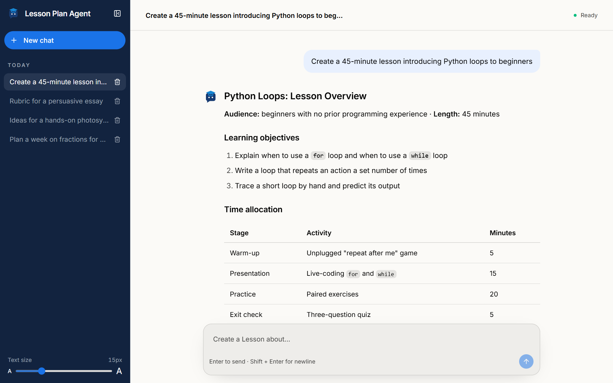
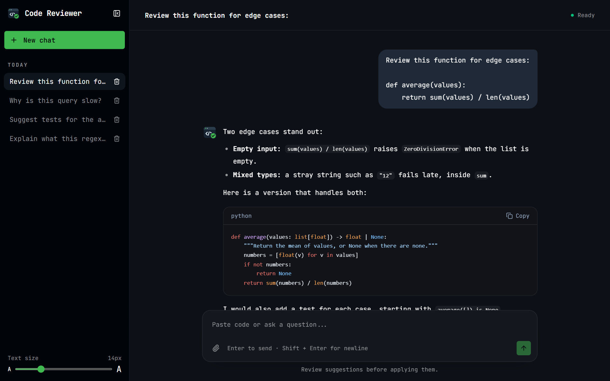
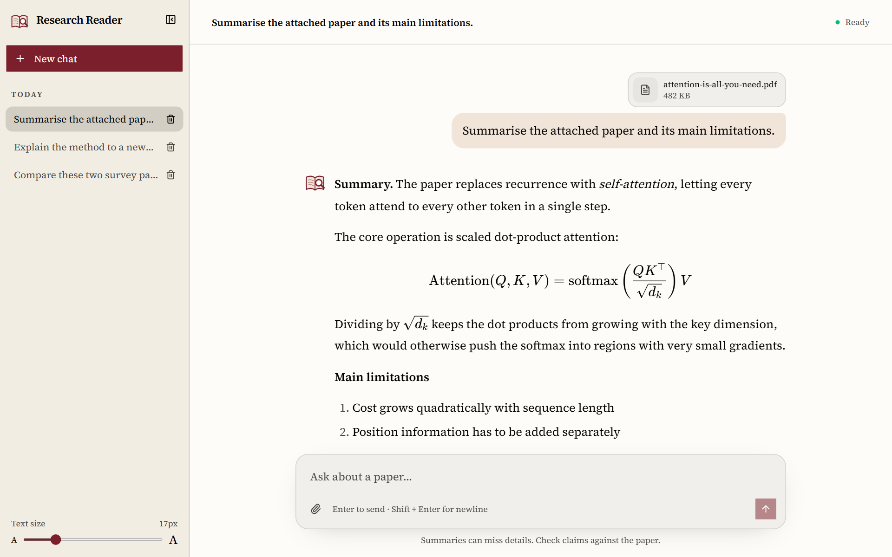
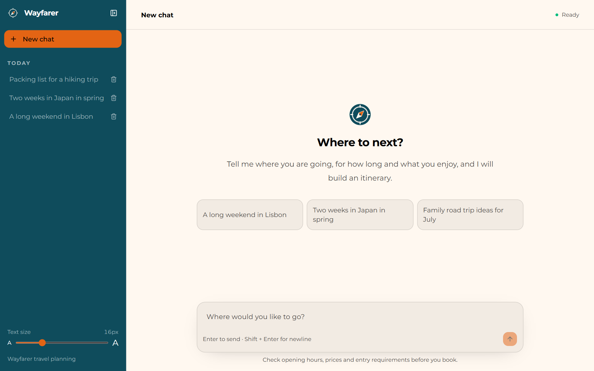

# Google ADK Chat Frontend

A chat UI for Google ADK agents that you can rebrand in seconds. It is built for demos: point it at an ADK agent, edit one JSON file to set the name, logo, colours and font, and you have a polished, branded chat app to show.

It is MIT licensed, so beyond demos you are free to use it, change it and ship it however you like.



The same app with three of the other [example configs](#example-configs):

| | |
| --- | --- |
|  |  |
| **Code Reviewer**: forced dark mode, monospace font, highlighted code | **Research Reader**: serif font, file upload, LaTeX, larger default text |
|  | |
| **Wayfarer**: welcome screen with suggestions and a disclaimer | |

What you get:

- Multiple chat sessions, backed by ADK sessions
- File uploads by button, drag and drop, or paste
- Streamed Markdown with tables, highlighted code and LaTeX
- Branding and theme from `chat.config.json`: name, logo, favicon, welcome text, colours, light or dark mode, font, button shape
- A collapsible sidebar and a text-size slider for readability
- Seven ready-made example configs in `examples/`

## Quick start

You need [Node.js](https://nodejs.org) 20.9 or newer, [pnpm](https://pnpm.io), and an agent built with the [Google Agent Development Kit](https://google.github.io/adk-docs/).

1. Start your Python ADK API server in its own terminal: `uv run adk api_server . --port 8000` from the directory **containing** your agent folder. Confirm http://127.0.0.1:8000/list-apps includes your agent.
2. Copy `.env.example` to `.env.local`. Set `ADK_APP_NAME` to the exact `/list-apps` result. Keep `ADK_MOCK_MODE=false` for live ADK.
3. Run `pnpm install` and `pnpm dev` in this frontend directory. Open http://localhost:3000.
4. Edit `chat.config.json` to rebrand it, or copy one of the [example configs](#example-configs) over it.

No agent yet? Set `ADK_MOCK_MODE=true` in `.env.local` and restart `pnpm dev`. Mock mode replies with canned text, does not need ADK, and keeps its sessions in memory. It only works in development.

To run a production build, use `pnpm build` and then `pnpm start`.

## Configuration

Branding, uploads and theme are set in `chat.config.json`. Any key left out falls back to its built-in default. `pnpm dev` picks up edits immediately; a production deployment needs a rebuild.

### Default config

```json
{
  "appName": "Orbit",
  "appDescription": "A focused chat workspace powered by a Google ADK agent.",
  "logoUrl": "",
  "logoDarkUrl": "",
  "faviconUrl": "",
  "welcomeTitle": "How can I help today?",
  "welcomeMessage": "I'm your ADK assistant. Ask me anything, or attach a file and I'll take a look.",
  "suggestions": ["Explain a concept", "Review some code", "Help me plan a project"],
  "inputPlaceholder": "Message your ADK agent...",
  "footerText": "Powered by a Google ADK agent",
  "disclaimer": "",
  "uploads": {
    "enabled": true,
    "maxFiles": 5,
    "maxFileSizeMb": 10,
    "accept": "image/*,application/pdf,text/*,audio/*,video/*,.txt,.md,.csv,.json"
  },
  "fontSize": { "default": 15, "adjustable": true, "min": 12, "max": 24 },
  "theme": {
    "mode": "system",
    "font": "",
    "fontUrl": "",
    "buttonRadius": "",
    "light": {
      "background": "",
      "sidebarBackground": "",
      "buttonColor": "",
      "chatBubbleColor": ""
    },
    "dark": {
      "background": "",
      "sidebarBackground": "",
      "buttonColor": "",
      "chatBubbleColor": ""
    }
  }
}
```

### Branding and uploads

| Key | Purpose |
| --- | --- |
| `appName` | Name in the sidebar and browser tab |
| `appDescription` | Page meta description |
| `logoUrl` | Logo image: a path under `public/` (`/logo.svg`) or a URL. Empty uses the built-in mark |
| `logoDarkUrl` | Optional logo for dark mode |
| `faviconUrl` | Browser tab icon. Empty uses `public/favicon.svg` |
| `welcomeTitle` | Heading on an empty chat |
| `welcomeMessage` | Text under the heading (Markdown) |
| `suggestions` | Starter prompts |
| `inputPlaceholder` | Message box placeholder |
| `footerText` | Sidebar footer |
| `disclaimer` | Small print under the message box |
| `uploads.enabled` | Turn file uploads on or off |
| `uploads.maxFiles` | Files per message |
| `uploads.maxFileSizeMb` | Size limit per file |
| `uploads.accept` | Allowed types, e.g. `image/*,application/pdf,.csv`. Empty allows anything |

To hide something (the footer, the suggestions), set it to `""` or `[]`.

### Text size

| Key | Purpose |
| --- | --- |
| `fontSize.default` | Size of chat text in pixels |
| `fontSize.adjustable` | Shows a text-size slider at the bottom of the sidebar. `false` hides it |
| `fontSize.min`, `fontSize.max` | Range of the slider, in pixels |

The slider changes message and input text only. The sidebar, header and buttons keep their size, so larger text gets the room that browser zoom would take away. Each visitor's choice is remembered in their browser.

### Theme

| Key | Purpose |
| --- | --- |
| `theme.mode` | `"system"` follows the visitor's device; `"light"` or `"dark"` forces one |
| `theme.font` | CSS font-family, e.g. `"Inter, sans-serif"`. Empty uses the system font |
| `theme.fontUrl` | Stylesheet that loads the font, e.g. a Google Fonts URL. Not needed for fonts already on the device |
| `theme.buttonRadius` | Corner radius of buttons as a CSS length: `"4px"`, or `"9999px"` for pills |
| `theme.light`, `theme.dark` | Colours for each mode, with the four keys below |
| `background` | Main page background |
| `sidebarBackground` | Side panel background |
| `buttonColor` | Buttons and the built-in logo mark |
| `chatBubbleColor` | Your own message bubble. Empty follows `buttonColor` |

Colours take any CSS colour (`#1a73e8`, `rgb(26 115 232)`, `oklch(...)`); empty keeps the built-in one. You only choose the surfaces: text on each one switches between black and white for contrast, and borders, hover states and the message box are tinted from the background you set. Set only `background` and the sidebar and buttons follow it.

For example, a forced light theme with a blue brand colour:

```json
"theme": {
  "mode": "light",
  "font": "Inter, sans-serif",
  "fontUrl": "https://fonts.googleapis.com/css2?family=Inter:wght@400;500;600&display=swap",
  "buttonRadius": "9999px",
  "light": {
    "background": "#fbfaf7",
    "sidebarBackground": "#12233f",
    "buttonColor": "#1a73e8",
    "chatBubbleColor": "#e8f0fe"
  }
}
```

### Example configs

`examples/` holds seven complete configs. To try one, copy it over `chat.config.json`:

```sh
cp examples/support-desk.json chat.config.json
```

| File | App | Shows |
| --- | --- | --- |
| `lesson-plan-agent.json` | Lesson Plan Agent | Forced light mode, dark sidebar, pill buttons, uploads off |
| `credit-analyst.json` | Credit Analyst Assistant | PDF and CSV uploads, disclaimer, square buttons |
| `support-desk.json` | Support Desk | Follows the device, with separate light and dark palettes |
| `code-reviewer.json` | Code Reviewer | Forced dark mode, monospace font, source-file uploads |
| `travel-planner.json` | Wayfarer | Warm light theme, suggestions, uploads off |
| `research-reader.json` | Research Reader | Serif font, larger default text, PDF-only uploads |
| `kitchen-companion.json` | Sous Chef | Image-only uploads, text-size slider hidden |

Each example reads its logo and favicon from `public/examples/<name>/`: `logo.svg`, `favicon.svg`, and `logo-dark.svg` for the two that follow the device (`support-desk`, `research-reader`).

## How it works

- **Sessions** are ADK sessions. The sidebar lists, opens and deletes them through the ADK API. ADK sessions have no name, so each chat's title (its first message) is remembered in the browser's localStorage and re-derived from the session when missing.
- **Files** are attached with the paperclip, by drag and drop, or by pasting. They are sent to the agent inline (`inlineData` parts), so the model behind your agent must accept the file type; Gemini takes images, PDF, text, audio and video, with a total request size of about 20 MB. ADK does not store file names, so a reopened chat labels non-image files by type.
- **Routes**: `POST /api/chat` streams a reply, `GET /api/sessions` lists chats, `GET` and `DELETE /api/sessions/[id]` load and remove one. All of them proxy to `ADK_API_URL`.

## Project layout

| Path | Contents |
| --- | --- |
| `chat.config.json` | Your branding, upload and theme settings |
| `examples/` | Example configs to copy over `chat.config.json` |
| `public/` | Logos, favicons and other static files |
| `src/app/` | The page, global styles and the API routes that proxy to ADK |
| `src/components/` | The chat UI: shell, sidebar, composer, messages, Markdown renderer |
| `src/lib/` | Config loading, theme CSS generation and ADK helpers |
| `.env.local` | Where your ADK server is (`ADK_API_URL`, `ADK_APP_NAME`) |

## Troubleshooting

- Any real-backend error should appear in the chat UI; inspect the frontend terminal for more detail.
- The ADK API's `/run_sse` body uses `appName`, `userId`, `sessionId`, `newMessage` (camelCase).
- **Conversation history persistence across ADK restarts depends on the backend SessionService**; default in-memory storage will not survive an ADK restart.
- Users are anonymous browser-generated IDs, not a production authentication setup. Anyone who can reach the server and knows a user ID can read that user's chats.

## Credits

The first version was generated with [Vercel v0](https://v0.app) and then refined with [Claude Code](https://claude.com/claude-code).

## License

[MIT](LICENSE). Use it, change it, and ship it, for demos or anything else.
