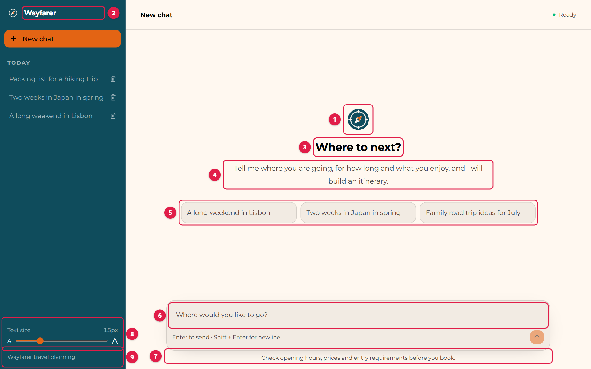
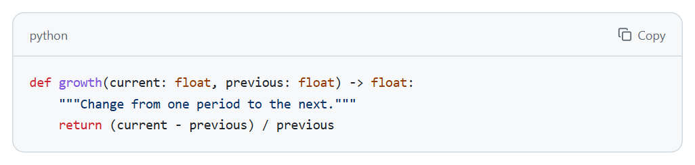
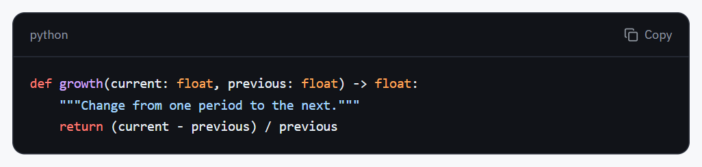
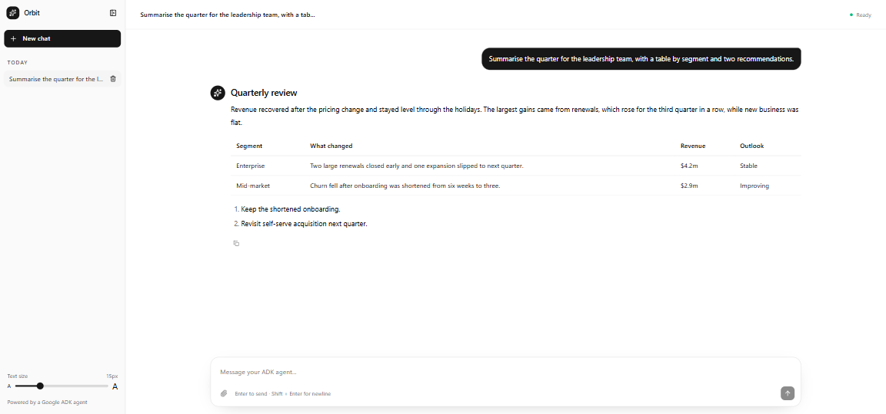
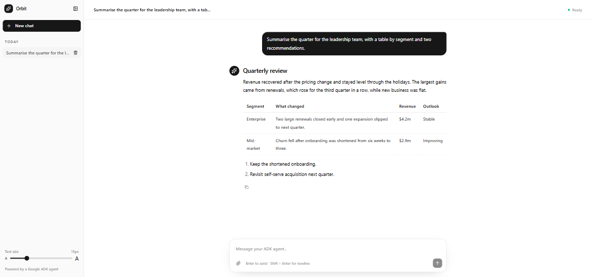
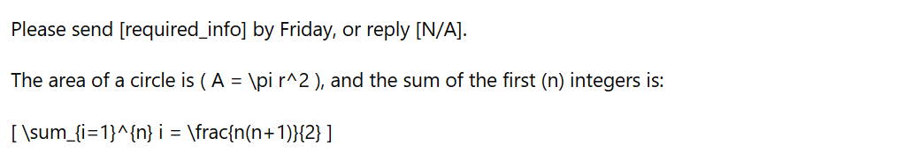
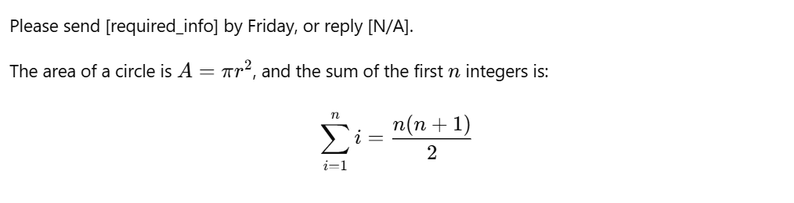

# Google ADK Chat Frontend

A chat UI for Google ADK agents that you can rebrand in seconds. It is built for demos: point it at an ADK agent, edit one JSON file to set the name, logo, colours and font, and you have a polished, branded chat app to show.

It is MIT licensed, so beyond demos you are free to use it, change it and ship it however you like.


The same app with three of the other [example configs](#example-configs):

| | |
| --- | --- |
|  |  |
| **Code Reviewer**: forced dark mode, monospace font, highlighted code | **Research Reader**: serif font, file upload, LaTeX, larger text in a narrower column |
|  | |
| **Wayfarer**: welcome screen with suggestions and a disclaimer | |

What you get:

- Multiple chat sessions, backed by ADK sessions
- File uploads by button, drag and drop, or paste
- Streamed Markdown with tables, highlighted code and LaTeX
- Branding and theme from `chat.config.json`: name, logo, favicon, welcome text, colours, light or dark mode, font, button shape
- A sidebar you can collapse to an icon rail or drag to resize, and a text-size slider for readability
- Eight example configs in `examples/`, from two settings to a fully customised one

## Quick start

You need [Node.js](https://nodejs.org) 20.9 or newer, which includes npm, and an agent built with the [Google Agent Development Kit](https://google.github.io/adk-docs/).

1. Start your Python ADK API server in its own terminal: `uv run adk api_server . --port 8000` from the directory **containing** your agent folder. Confirm http://127.0.0.1:8000/list-apps includes your agent.
2. Copy `.env.example` to `.env.local`. Set `ADK_APP_NAME` to the exact `/list-apps` result. Keep `ADK_MOCK_MODE=false` for live ADK.
3. Run `npm install` and `npm run dev` in this frontend directory. Open http://localhost:3000.
4. Edit `chat.config.json` to rebrand it, or copy one of the [example configs](#example-configs) over it.

No agent yet? Set `ADK_MOCK_MODE=true` in `.env.local` and restart `npm run dev`. Mock mode replies with canned text, does not need ADK, and keeps its sessions in memory. It only works in development.

To run a production build, use `npm run build` and then `npm start`.

## Configuration

Everything is set in `chat.config.json`. **You only need the keys you want to change**: anything you leave out uses its default, including whole sections and individual keys inside a section. The smallest useful config is two lines:

```json
{
  "appName": "Helpdesk Bot",
  "welcomeTitle": "What do you need help with?"
}
```

`npm run dev` picks up edits immediately; a production deployment needs a rebuild.

### The starter config

The `chat.config.json` in this repo lists the settings most people change: the name, logo, welcome screen, small print and colours. Empty values mean "use the built-in look".

```json
{
  "appName": "Orbit",
  "logoUrl": "",
  "faviconUrl": "",
  "welcomeTitle": "How can I help today?",
  "welcomeMessage": "I'm your ADK assistant. Ask me anything, or attach a file and I'll take a look.",
  "suggestions": ["Explain a concept", "Review some code", "Help me plan a project"],
  "inputPlaceholder": "Message your ADK agent...",
  "footerText": "Powered by a Google ADK agent",
  "disclaimer": "",
  "theme": {
    "mode": "system",
    "light": { "background": "", "sidebarBackground": "", "buttonColor": "", "chatBubbleColor": "" },
    "dark": { "background": "", "sidebarBackground": "", "buttonColor": "", "chatBubbleColor": "" }
  }
}
```

### Branding



| | Key | Purpose |
| --- | --- | --- |
| 1 | `logoUrl` | Logo image: a path under `public/` (`/logo.svg`) or a URL. It appears on the welcome screen, at the top of the sidebar and beside each reply. Empty uses the built-in mark |
| | `logoDarkUrl` | Optional logo for dark mode |
| 2 | `appName` | Name at the top of the sidebar and in the browser tab. Long names wrap onto a second line |
| 3 | `welcomeTitle` | Heading on an empty chat |
| 4 | `welcomeMessage` | Text under the heading (Markdown) |
| 5 | `suggestions` | Starter prompts. Clicking one sends it |
| 6 | `inputPlaceholder` | Message box placeholder |
| 7 | `disclaimer` | One line of small print centred under the message box, visible on every screen, e.g. "AI can make mistakes. Check important information." Empty shows nothing |
| 8 | `fontSize` | The text-size slider. See [Text size](#text-size) |
| 9 | `footerText` | Small print at the bottom of the sidebar. Hidden while the sidebar is collapsed |
| | `faviconUrl` | Browser tab icon. Empty uses `public/favicon.svg` |
| | `appDescription` | Page meta description, used by search engines and link previews |

To hide something (the footer, the suggestions), set it to `""` or `[]`.

### Theme

| Key | Purpose |
| --- | --- |
| `theme.mode` | `"system"` follows the visitor's device; `"light"` or `"dark"` forces one |
| `theme.light`, `theme.dark` | Colours for each mode, with the four keys below |
| `background` | Main page background |
| `sidebarBackground` | Side panel background |
| `buttonColor` | Buttons and the built-in logo mark |
| `chatBubbleColor` | Your own message bubble. Empty follows `buttonColor` |
| `theme.font` | CSS font-family, e.g. `"Inter, sans-serif"`. Empty uses the system font |
| `theme.fontUrl` | Stylesheet that loads the font, e.g. a Google Fonts URL. Not needed for fonts already on the device |
| `theme.buttonRadius` | Corner radius of buttons as a CSS length: `"4px"`, or `"9999px"` for pills |
| `theme.codeTheme` | Colours of code blocks: `"auto"`, `"light"` or `"dark"`. See below |
| `theme.chatWidth` | Widest the conversation column gets. See below |

Colours take any CSS colour (`#1a73e8`, `rgb(26 115 232)`, `oklch(...)`); empty keeps the built-in one. You only choose the surfaces: text on each one switches between black and white for contrast, and borders, hover states and the message box are tinted from the background you set. Set only `background` and the sidebar and buttons follow it.

For example, a forced light theme with a blue brand colour:

```json
"theme": {
  "mode": "light",
  "font": "Inter, sans-serif",
  "fontUrl": "https://fonts.googleapis.com/css2?family=Inter:wght@400;500;600&display=swap",
  "buttonRadius": "9999px",
  "light": {
    "background": "#fbfaf7",
    "sidebarBackground": "#12233f",
    "buttonColor": "#1a73e8",
    "chatBubbleColor": "#e8f0fe"
  }
}
```

**`theme.codeTheme`** defaults to `"auto"`: code blocks are light when the page is light and dark when it is dark. `"light"` or `"dark"` pins one, so you can have dark code blocks on a light page.

| `"light"`, or `"auto"` on a light page | `"dark"`, or `"auto"` on a dark page |
| --- | --- |
|  |  |

**`theme.chatWidth`** is the widest the conversation column gets, as a CSS length. Empty scales with the window: 48rem on a laptop, growing to 90rem on a large monitor. Set `"48rem"` for a narrow reading column at every size, or `"100%"` to fill the window. Both pictures below are a 1920px-wide window.

| Empty (the default) | `"48rem"` |
| --- | --- |
|  |  |

### Uploads

| Key | Default | Purpose |
| --- | --- | --- |
| `uploads.enabled` | `true` | `false` removes the attach button and stops drag and drop and paste |
| `uploads.maxFiles` | `5` | Files per message |
| `uploads.maxFileSizeMb` | `10` | Size limit per file |
| `uploads.accept` | images, PDF, text, audio, video | Allowed types as a comma-separated list, e.g. `"image/*,application/pdf,.csv"`. Empty allows anything |

Set only what differs. `"uploads": { "accept": "image/*" }` keeps the other three defaults.

### Text size

Most projects can leave this section out.

| Key | Default | Purpose |
| --- | --- | --- |
| `fontSize.default` | `15` | Size of chat text in pixels |
| `fontSize.adjustable` | `true` | Shows the text-size slider at the bottom of the sidebar. `false` hides it |
| `fontSize.min`, `fontSize.max` | `12`, `24` | Range of the slider, in pixels |

The slider changes message and input text only. The sidebar, header and buttons keep their size, so larger text gets the room that browser zoom would take away. Each visitor's choice is remembered in their browser.

### Markdown and maths

Most projects can leave this section out too. It is there to fix one specific symptom: an agent whose equations show up as raw LaTeX.

Replies are rendered as standard Markdown with tables, highlighted code and LaTeX. Maths goes between dollar signs, which is how Gemini writes it: `$x^2$` inline and `$$x^2$$` for a centred equation.

| Key | Default | Purpose |
| --- | --- | --- |
| `markdown.bracketMath` | `false` | Whether `\( ... \)` and `\[ ... \]` are read as LaTeX |

In standard Markdown a backslash before a bracket means a literal bracket, so with `false` the text `\[required\_info\]` shows as [required_info]. Some models write maths between those brackets instead of dollar signs. If your agent does, set this to `true`: brackets whose contents look like maths are then rendered as equations, and ones that do not are still shown as text.

The same reply with the setting off and on:

| `false` (the default) | `true` |
| --- | --- |
|  |  |

### Every setting and its default

For reference, this is what the app uses when `chat.config.json` is empty.

```json
{
  "appName": "Orbit",
  "appDescription": "A focused chat workspace powered by a Google ADK agent.",
  "logoUrl": "",
  "logoDarkUrl": "",
  "faviconUrl": "",
  "welcomeTitle": "How can I help today?",
  "welcomeMessage": "I'm your ADK assistant. Ask me anything, or attach a file and I'll take a look.",
  "suggestions": ["Explain a concept", "Review some code", "Help me plan a project"],
  "inputPlaceholder": "Message your ADK agent...",
  "footerText": "Powered by a Google ADK agent",
  "disclaimer": "",
  "uploads": {
    "enabled": true,
    "maxFiles": 5,
    "maxFileSizeMb": 10,
    "accept": "image/*,application/pdf,text/*,audio/*,video/*,.txt,.md,.csv,.json"
  },
  "fontSize": { "default": 15, "adjustable": true, "min": 12, "max": 24 },
  "markdown": { "bracketMath": false },
  "theme": {
    "mode": "system",
    "font": "",
    "fontUrl": "",
    "buttonRadius": "",
    "codeTheme": "auto",
    "chatWidth": "",
    "light": {
      "background": "",
      "sidebarBackground": "",
      "buttonColor": "",
      "chatBubbleColor": ""
    },
    "dark": {
      "background": "",
      "sidebarBackground": "",
      "buttonColor": "",
      "chatBubbleColor": ""
    }
  }
}
```

### Example configs

`examples/` holds eight configs of different sizes, each setting only what it needs. To try one, copy it over `chat.config.json`:

```sh
cp examples/support-desk.json chat.config.json
```

| File | App | What it sets beyond the branding |
| --- | --- | --- |
| `minimal.json` | Helpdesk Bot | Almost nothing: a name, a welcome title and one button colour per mode |
| `lesson-plan-agent.json` | Lesson Plan Agent | A light theme with a dark sidebar and pill buttons; uploads off |
| `travel-planner.json` | Wayfarer | A warm light theme with a Google font, a footer and a disclaimer; uploads off |
| `support-desk.json` | Support Desk | Follows the device, so it has both a light and a dark palette and a dark-mode logo |
| `kitchen-companion.json` | Sous Chef | Two partly-set sections: image-only uploads, and the text-size slider hidden |
| `credit-analyst.json` | Credit Analyst Assistant | PDF and CSV uploads with a larger size limit; dark code blocks on a light page |
| `code-reviewer.json` | Code Reviewer | Forced dark mode, a monospace font, smaller text and source-file uploads |
| `research-reader.json` | Research Reader | The fullest: serif font, larger text, a narrower reading column, PDF-only uploads and `bracketMath` on |

Each example except `minimal.json` reads its logo and favicon from `public/examples/<name>/`: `logo.svg`, `favicon.svg`, and `logo-dark.svg` for the two that follow the device (`support-desk`, `research-reader`).

## How it works

- **Sessions** are ADK sessions. The sidebar lists, opens and deletes them through the ADK API. ADK sessions have no name, so each chat's title (its first message) is remembered in the browser's localStorage and re-derived from the session when missing.
- **Files** are attached with the paperclip, by drag and drop, or by pasting. They are sent to the agent inline (`inlineData` parts), so the model behind your agent must accept the file type; Gemini takes images, PDF, text, audio and video, with a total request size of about 20 MB. ADK does not store file names, so a reopened chat labels non-image files by type.
- **Routes**: `POST /api/chat` streams a reply, `GET /api/sessions` lists chats, `GET` and `DELETE /api/sessions/[id]` load and remove one. All of them proxy to `ADK_API_URL`.

## Project layout

| Path | Contents |
| --- | --- |
| `chat.config.json` | Your branding, upload and theme settings |
| `examples/` | Example configs to copy over `chat.config.json` |
| `public/` | Logos, favicons and other static files |
| `src/app/` | The page, global styles and the API routes that proxy to ADK |
| `src/components/` | The chat UI: shell, sidebar, composer, messages, Markdown renderer |
| `src/lib/` | Config loading, theme CSS generation and ADK helpers |
| `.env.local` | Where your ADK server is (`ADK_API_URL`, `ADK_APP_NAME`) |

## Troubleshooting

- Any real-backend error should appear in the chat UI; inspect the frontend terminal for more detail.
- The ADK API's `/run_sse` body uses `appName`, `userId`, `sessionId`, `newMessage` (camelCase).
- **Conversation history persistence across ADK restarts depends on the backend SessionService**; default in-memory storage will not survive an ADK restart.
- Users are anonymous browser-generated IDs, not a production authentication setup. Anyone who can reach the server and knows a user ID can read that user's chats.

## Credits

The first version was generated with [Vercel v0](https://v0.app) and then refined with [Claude Code](https://claude.com/claude-code).

## License

[MIT](LICENSE). Use it, change it, and ship it, for demos or anything else.
